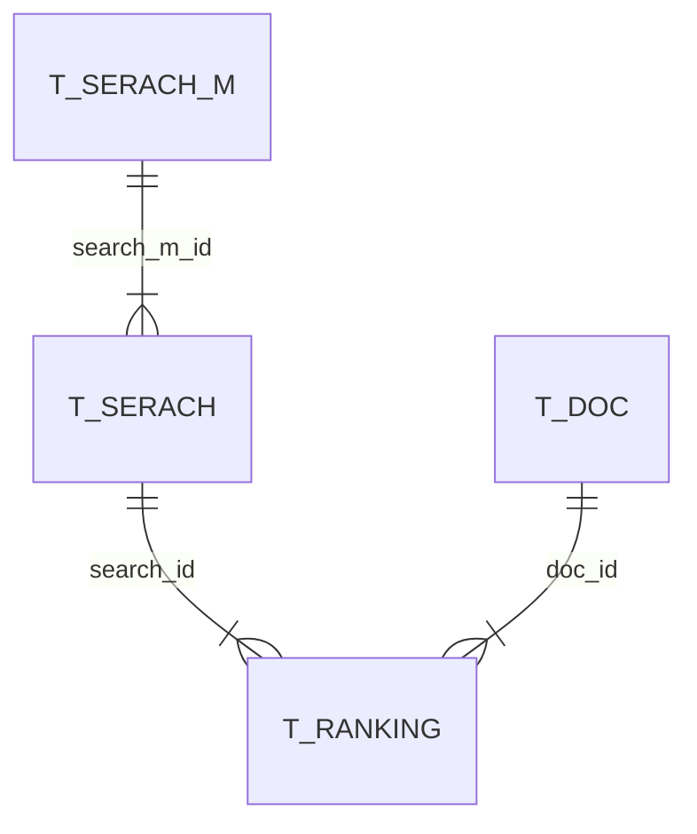
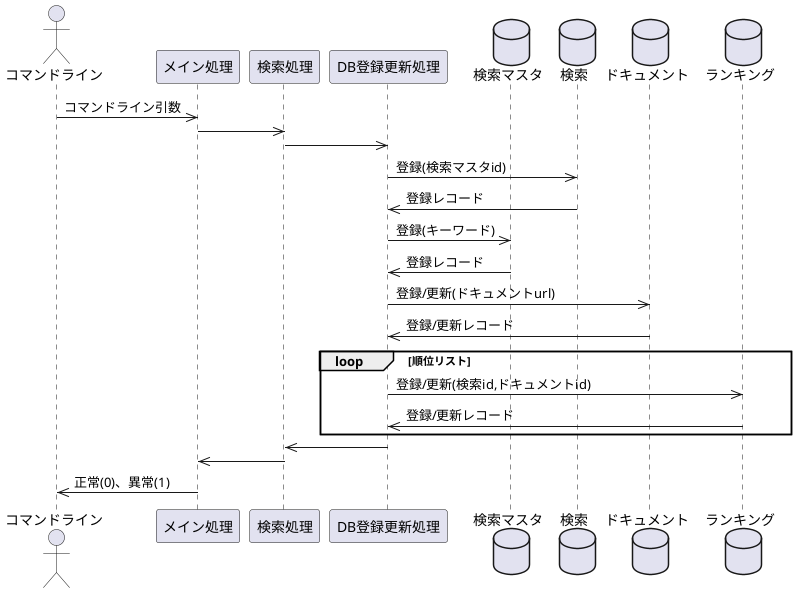

# ランキングチェッカー

与えられたキーワードのランキングチェックをおこないます。
このツールを作成した経緯については以下のサイトをごらんください。

[pythonでキーワードのランキングチェックツールを作成してみた](https://www.dmysd.net/blog/archives/5)

## 事前準備

```sh
pip install sqlalchemy requests beautifulsoup4 lxml plotly pandas
```

## APIの有効化

Google APIキーを取得して環境変数のGCP_CUSTOM_SEARCH_API_KEYにAPIキーをセットします。
検索エンジンIDをGCP_CUSTOM_SEARCH_ENGINE_IDにセットします。

## 実行方法

### ランキング情報の取得

```sh
py RankingCheckAPI.py [--drop] [-u URL] [-db DBファイル名] [-m 調査最大順位] キーワード1 [キーワード2] [キーワード3] …
```

- キーワードでGoogle検索をおこなった際の順位ランキングをjsonとsqliteに出力する
- dropオプションを付与すると検索前にいったんデータベース上のテーブルをすべて削除する
- uオプションで自分の運営するサイトのURLを指定できる。DB上ではドキュメントの自ページフラグがTrueで登録される
- dbオプションで出力先のSQLiteのファイル名を指定できる。指定しない場合にはデフォルト値"ranking.sqlite3"で出力される
- mオプションで何位まで調査するかを指定する
- []で囲まれているのは省略可能な引数
- 順位検索のjsonは日付のフォルダが作成されその下に保存される

### 取得した情報のグラフ描画

```sh
py RankingPlot.py [-db DBファイル名] [キーワード1] [キーワード2] [キーワード3] …
```

- sqliteに格納されているランキングデータをグラフ出力する
- 日付/Plotのフォルダが作成されその下に検索キーワードの順位グラフをhtmlファイルで出力する

## ER図



## シーケンス図(RankingCheckAPI)



## 変更履歴

|ver.|履歴|
|:--|:--|
|0.1|初版|
|0.2|キーワードを追跡しやすいようにモデルを変更|
|0.3|データ可視化ツールを入れる前準備としてモデルを別ファイルに移動|
|0.4|Plotlyを用いて可視化するように修正|
|0.5|Cloud Search APIを用いるように修正|
