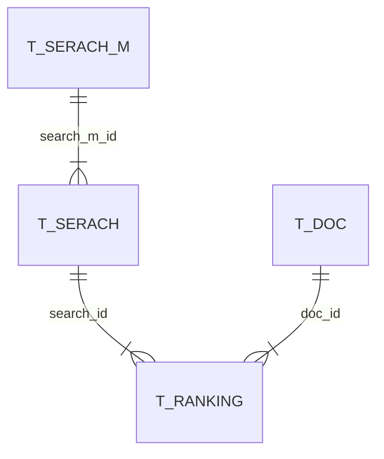
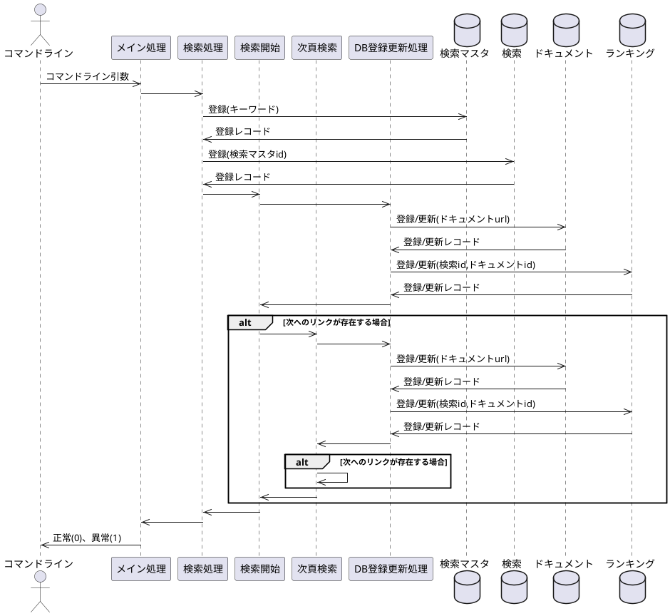

# ランキングチェッカー

与えられたキーワードのランキングチェックをおこないます。
このツールを作成した経緯については以下のサイトをごらんください。

[pythonでキーワードのランキングチェックツールを作成してみた](https://www.dmysd.net/news/archives/5)

## 事前準備

```sh
pip install sqlalchemy requests beautifulsoup4 lxml
```

## 実行方法

```sh
py RankingCheck.py [--drop] [-u URL] [-o DBファイル名] [-m 調査最大順位] キーワード1 [キーワード2] [キーワード3] …
```

- キーワードでGoogle検索をおこなった際の順位ランキングsqliteに出力する
- dropオプションを付与すると検索前にいったんデータベース上のテーブルをすべて削除する
- uオプションで自分の運営するサイトのURLを指定できる。DB上ではドキュメントの自ページフラグがTrueで登録される
- oオプションで出力先のSQLiteのファイル名を指定できる。指定しない場合にはデフォルト値"ranking.sqlite3"で出力される
- mオプションで何位まで調査するかを指定する
- []で囲まれているのは省略可能な引数
- 順位検索のHTMLは日時のフォルダが作成されその下に連番で保存される

## ER図



## シーケンス図



## 変更履歴

|ver.|履歴|
|:--|:--|
|0.1|初版|
|0.2|キーワードを追跡しやすいようにモデルを変更|
|0.3|データ可視化ツールを入れる前準備としてモデルを別ファイルに移動|
